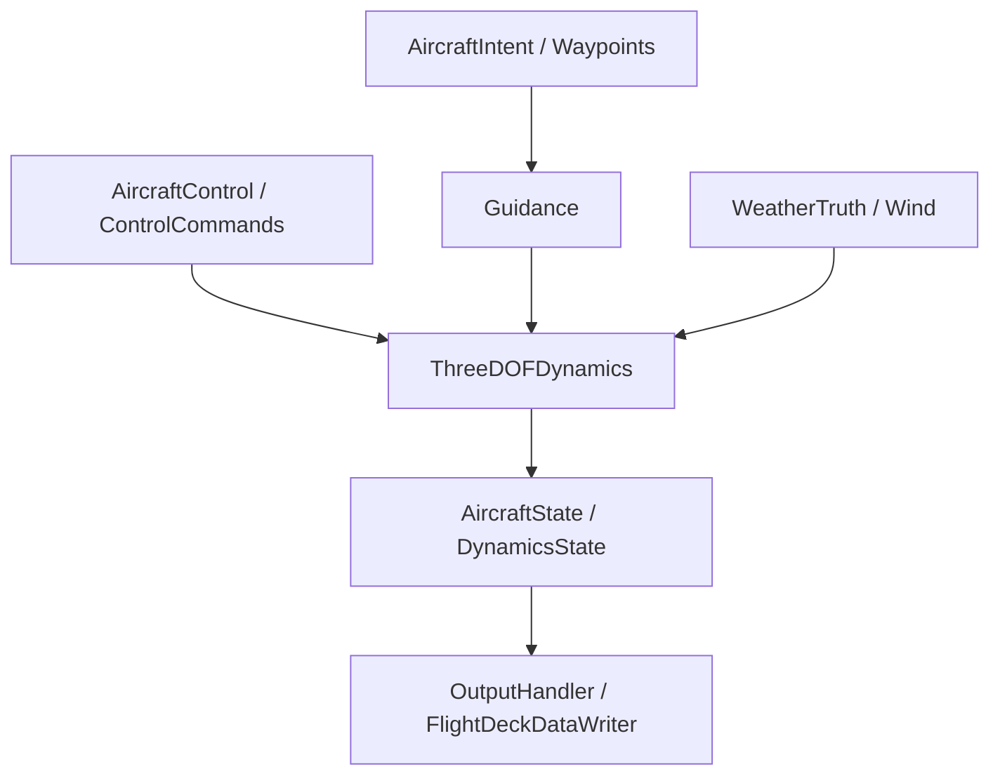

# Aircraft Simulation Core

> This is the copyright work of The MITRE Corporation, and was produced for the U. S. Government under Contract Number 693KA8-22-C-00001, and is subject
to Federal Aviation Administration Acquisition Management System Clause 3.5-13, Rights In Data-General (Oct. 2014), Alt. III and Alt. IV (Jan. 2009).  No other use other than that granted to the U. S. Government, or to those acting on behalf of the U. S. Government, under that Clause is authorized without the express written permission of The MITRE Corporation. For further information, please contact The MITRE Corporation, Contracts Management Office, 7515 Colshire Drive, McLean, VA  22102-7539, (703) 983-6000.
>
> (c) 2026 The MITRE Corporation. All Rights Reserved.
>
> Approved for Public Release; Distribution Unlimited. 15-1482

Aircraft Simulation Core is a C++ library for point-mass aircraft simulation primitives and algorithms. It is intended to be consumed by higher-level applications and scenario frameworks rather than run directly as an application.

## Public Surface

The library target is `mitre::oss::simcore`.

Public headers live under [`include/public`](../include/public). They include:

- Core state and command types such as `AircraftState`, `DynamicsState`, `Guidance`, `AircraftControl`, `ControlCommands`, and `Waypoint`.
- Dynamics, trajectory, and path implementations such as `ThreeDOFDynamics`, `KinematicTrajectoryPredictor`, `EuclideanTrajectoryPredictor`, `HorizontalPath`, and `VerticalPath`.
- Earth, geometry, weather, and wind utilities such as `EllipsoidalEarthModel`, `LocalTangentPlane`, `GeolibUtils`, `WindStack`, and `WeatherEstimate`.
- Extension points and null implementations for consumers that provide their own aircraft performance, controllers, weather operators, scenario entities, and data writers.

## Build And Test

Configure and build the public test executable:

```sh
cmake -S . -B build -DCMAKE_BUILD_TYPE=Release
cmake --build build --target simcore_public_tests --parallel
```

Run the public test suite:

```sh
ctest --test-dir build --output-on-failure --parallel 2
```

Build only the library target when tests are not needed:

```sh
cmake -S . -B build -DCMAKE_BUILD_TYPE=Release -DSIMCORE_BUILD_TESTING=OFF
cmake --build build --target simcore --parallel
```

## Consuming From CMake

Consumers can add the project with CPM and link to the exported alias:

```cmake
CPMAddPackage(
   NAME aircraft_simulation_core
   GITHUB_REPOSITORY mitre/aircraft_simulation_core
   GIT_TAG <tag-or-commit>
   OPTIONS
      "SIMCORE_BUILD_TESTING OFF"
)

target_link_libraries(my_target PRIVATE mitre::oss::simcore)
```

`simcore` pulls in its direct library dependencies: `cppuom`, `log4cplus`, `geolib`, `minicsv`, and `nlohmann_json`.

Scenario/run-file loading is intentionally outside this library.

## Simulation Flow



---

Happy Simulating!
